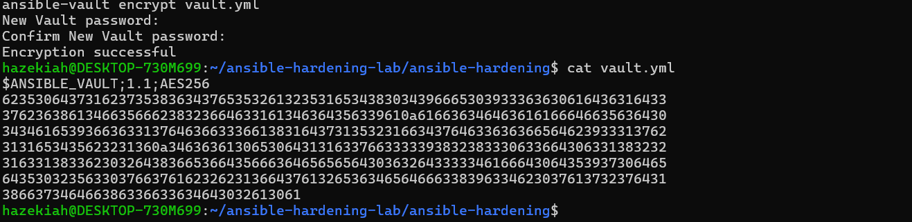
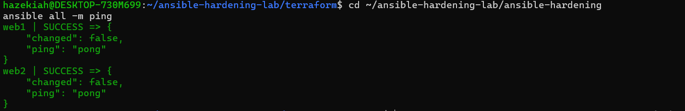
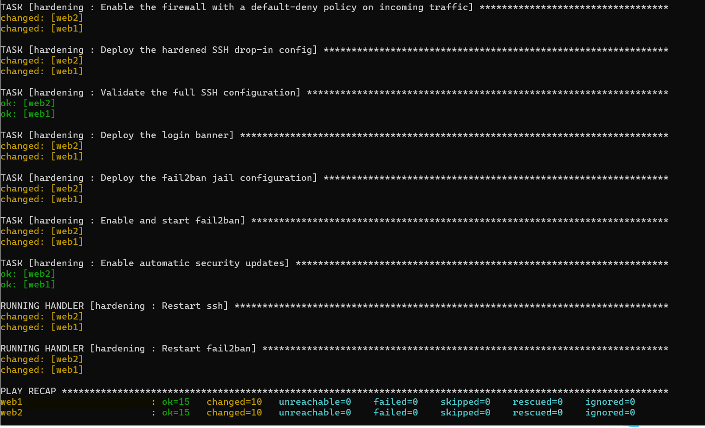
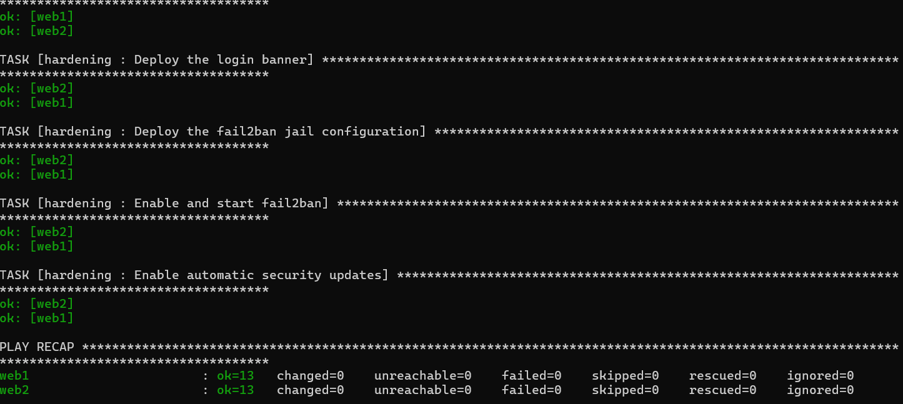
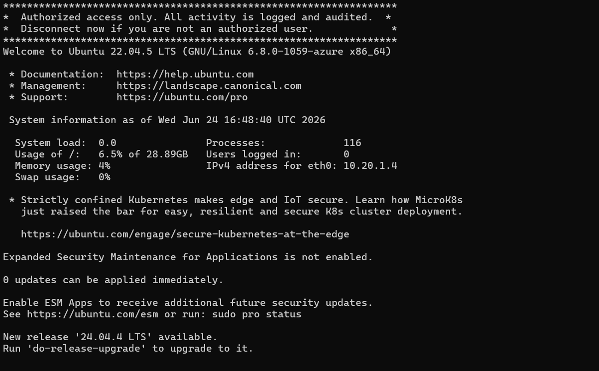
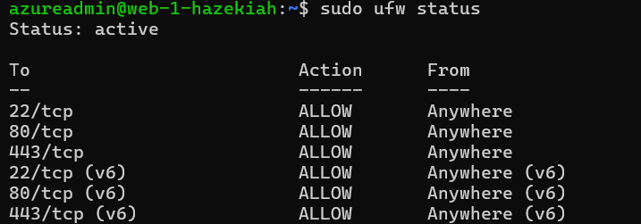
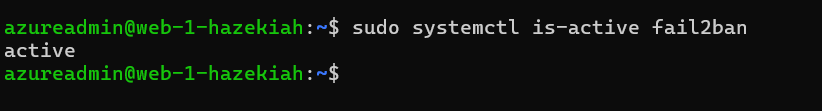
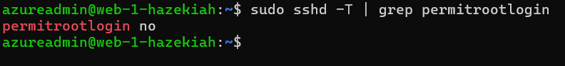
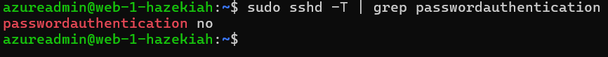
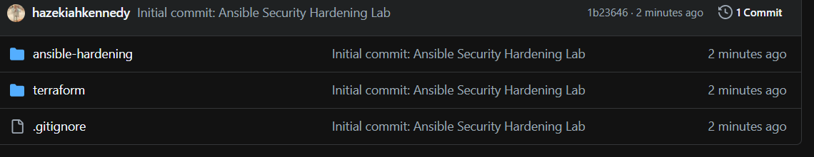

# Ansible Security Hardening Lab

**Lab #:** Project 8  
**Platform:** Microsoft Azure  
**Tools:** Terraform, Ansible, Ansible Vault, UFW, fail2ban, Ubuntu 22.04  
**Author:** Hazekiah Kennedy

---

## What This Does

Provisions a two-VM Linux fleet in Azure using Terraform, then applies an automated, idempotent security baseline across the entire fleet using Ansible. Every newly provisioned server gets locked down identically — SSH hardening, host firewall, intrusion prevention, automatic security patching, and a login banner — in a single playbook run. The second run makes zero changes, proving configuration drift is eliminated.

---

## Architecture

```
Terraform (Provision)
    └── Resource Group
    └── Virtual Network + Subnet
    └── Network Security Group (SSH locked to your IP, ports 80/443 open)
    └── 2x Ubuntu 22.04 VMs (Standard_D2s_v3 — westus2)
    └── Auto-generated inventory.ini → passed to Ansible

Ansible (Harden)
    └── site.yml → roles/hardening
            ├── apt update + security upgrades
            ├── Install ufw, fail2ban, unattended-upgrades
            ├── Admin password set from encrypted Vault
            ├── UFW firewall enabled (default-deny, allow 22/80/443)
            ├── SSH drop-in config (no root, no passwords, MaxAuthTries 3)
            ├── SSH config validated before restart (no lockout risk)
            ├── Login banner deployed
            ├── fail2ban configured (ban 1hr after 5 failures)
            └── Automatic security updates enabled
```

---

## Resources Deployed

| Resource | Name |
|---|---|
| Resource Group | rg-ansible-hardening-hazekiah |
| Virtual Network | vnet-hardening-hazekiah |
| Subnet | subnet-hardening |
| Network Security Group | nsg-hardening-hazekiah |
| Public IP (x2) | pip-web-1-hazekiah, pip-web-2-hazekiah |
| Network Interface (x2) | nic-web-1-hazekiah, nic-web-2-hazekiah |
| Linux VM (x2) | web-1-hazekiah, web-2-hazekiah |

---

## Project Structure

```
ansible-hardening-lab/
├── terraform/
│   ├── main.tf
│   ├── variables.tf
│   ├── outputs.tf
│   └── terraform.tfvars
└── ansible-hardening/
    ├── ansible.cfg
    ├── inventory.ini
    ├── site.yml
    ├── group_vars/
    │   └── all.yml
    ├── vault.yml
    ├── images/
    └── roles/hardening/
        ├── defaults/main.yml
        ├── handlers/main.yml
        ├── tasks/main.yml
        └── templates/
            ├── 00-hardening.conf.j2
            ├── issue.net.j2
            └── jail.local.j2
```

---

## How to Run

### Prerequisites
- WSL2 with Ubuntu
- Terraform installed in WSL
- Azure CLI installed in WSL
- Ansible installed in WSL
- community.general collection
- SSH key pair at ~/.ssh/ansible_lab

### 1. Provision the Fleet
```bash
cd terraform
export ARM_SUBSCRIPTION_ID=$(az account show --query id -o tsv)
terraform init
terraform apply
```

### 2. Test Connectivity
```bash
cd ../ansible-hardening
ansible all -m ping
```

### 3. Run the Hardening Playbook
```bash
ansible-playbook site.yml -e @vault.yml --ask-vault-pass
```

### 4. Prove Idempotency
```bash
ansible-playbook site.yml -e @vault.yml --ask-vault-pass
```

### 5. Teardown
```bash
cd ../terraform
terraform destroy
```

---

## Verification

```bash
sudo ufw status
sudo systemctl is-active fail2ban
sudo sshd -T | grep permitrootlogin
sudo sshd -T | grep passwordauthentication
```

---

## Screenshots

### 01 — Vault Encrypted
The vault.yml file after running ansible-vault encrypt. The secret (admin password) is stored as AES256 ciphertext — never in plaintext. This is what gets committed to source control safely. Anyone who gets the file sees only gibberish without the vault password.



### 02 — Ansible Ping Success
Both web1 and web2 returning SUCCESS with "pong" — confirming Ansible can reach both VMs over SSH before the hardening playbook runs. This validates the inventory, SSH key, and NSG rules are all correct.



### 03 — First Playbook Run
PLAY RECAP from the first hardening run showing ok=15 changed=10 failed=0 on both hosts. Every hardening task applied successfully — firewall enabled, SSH locked down, fail2ban running, banner deployed, auto-updates configured.



### 04 — Second Playbook Run (Idempotency Proof)
PLAY RECAP from the second run showing changed=0 failed=0 on both hosts. Nothing changed because both servers are already in the desired state. This is the definition of idempotency — run it once to apply, run it again to prove the fleet is already compliant.



### 05 — SSH Login Banner
The authorized-use banner displayed immediately after SSH connection before the login prompt. Deployed via Ansible template to /etc/issue.net and configured in the SSH drop-in config. Proof the template rendered correctly on the target host.



### 06 — UFW Firewall Status
Output of sudo ufw status on web-1-hazekiah showing Status: active with explicit ALLOW rules for ports 22, 80, and 443. All other inbound traffic is denied by default policy. The host firewall is active and correctly configured.



### 07 — fail2ban Active
Output of sudo systemctl is-active fail2ban returning active — confirming the intrusion prevention service is running and will ban IPs after 5 failed SSH login attempts for 1 hour.



### 08 — SSH PermitRootLogin Disabled
Output of sudo sshd -T | grep permitrootlogin returning permitrootlogin no — confirming direct root login over SSH is blocked. The 00-hardening.conf.j2 template applied correctly and is taking precedence over Ubuntu's default SSH config.



### 09 — SSH PasswordAuthentication Disabled
Output of sudo sshd -T | grep passwordauthentication returning passwordauthentication no — confirming password-based SSH logins are disabled. Only key-based authentication is accepted, eliminating brute-force password attacks entirely.



### 10 — GitHub Repo
The ansible-hardening-lab repository on GitHub showing the full project structure — terraform and ansible-hardening folders, .gitignore, and README. All lab files pushed and publicly accessible.


